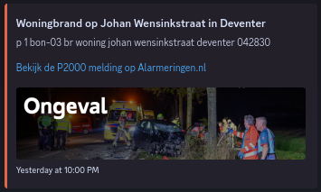

# AlarmHook

[Nederlands](https://github.com/ThijmenGThN/alarmhook)

An integration for the RSS feed of **alarmingen.nl** which sends data to the by you configured webhook on **Discord**.

 

  
  

 

> Setup can be achieved by the following options:

## Manual setup

1. Download the source code.
2. Rename ` sample.env ` to ` .env `.
3. Create a webhook and copy the URL.
4. Replace the values in ` .env `.
5. Ensure that Rust is installed.
6. Start the service with ` cargo run --release ` or compile it to a binary.

## Setup with Docker

1. Download the source code.
2. Rename ` sample.env ` to ` .env `.
3. Create a webhook and copy the URL.
4. Replace the values in ` .env `.
5. Run `docker-compose up -d`.

> Need help? [support@thijmenheuvelink.nl](mailto:support@thijmenheuvelink.nl)
