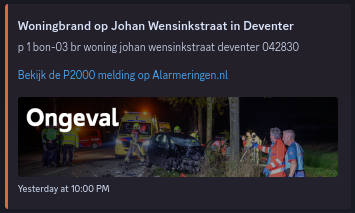
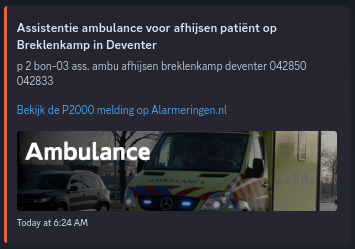

# AlarmHook

[English](https://github.com/ThijmenGThN/alarmhook/blob/main/readme.english.md)

Een integratie voor de RSS feed van **alarmingen.nl** die data verstuurd naar de door jou ingestelde webhook op **Discord**.

> Opzetten kan via de volgende twee opties:

## Handmatig opzetten

1. Download de source code.
2. Hernoem ` sample.env ` naar ` .env `.
3. Maak een webhook aan en kopieer de URL.
4. Vervang de data in de ` .env `.
5. Zorg dat Rust is geinstalleerd.
6. Start de service met ` cargo run --release ` of compileer naar een binary.

## Opzetten met Docker

1. Download de source code.
2. Hernoem ` sample.env ` naar ` .env `.
3. Maak een webhook aan en kopieer de URL.
4. Vervang de data in de ` .env `.
5. Voer `docker-compose up -d` uit.

> Hulp nodig? [support@thijmenheuvelink.nl](mailto:support@thijmenheuvelink.nl)
